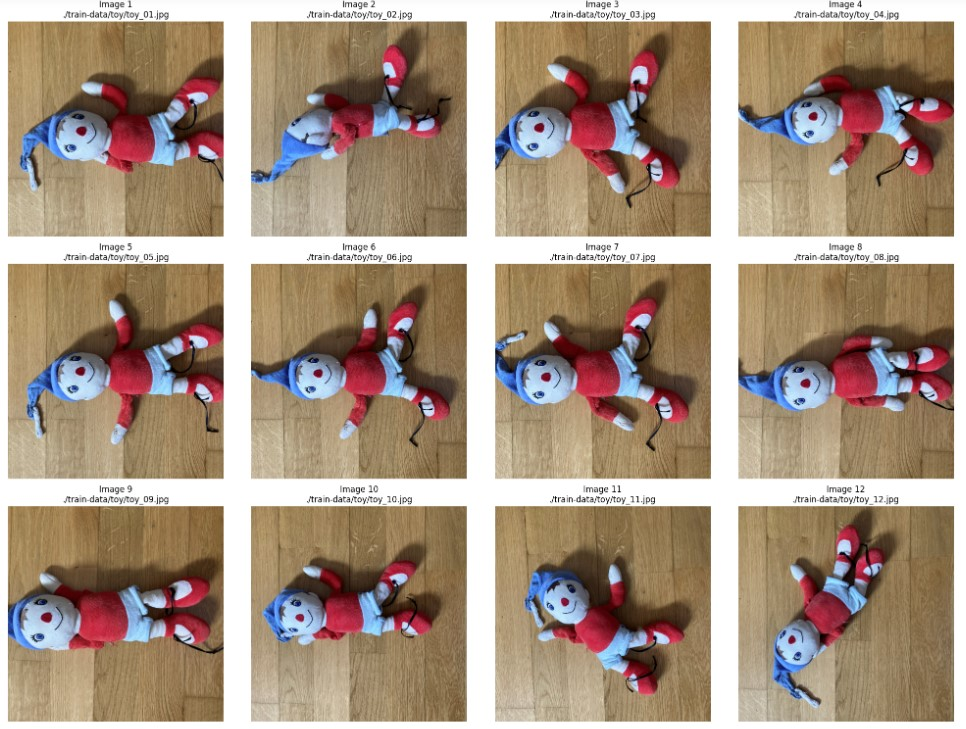
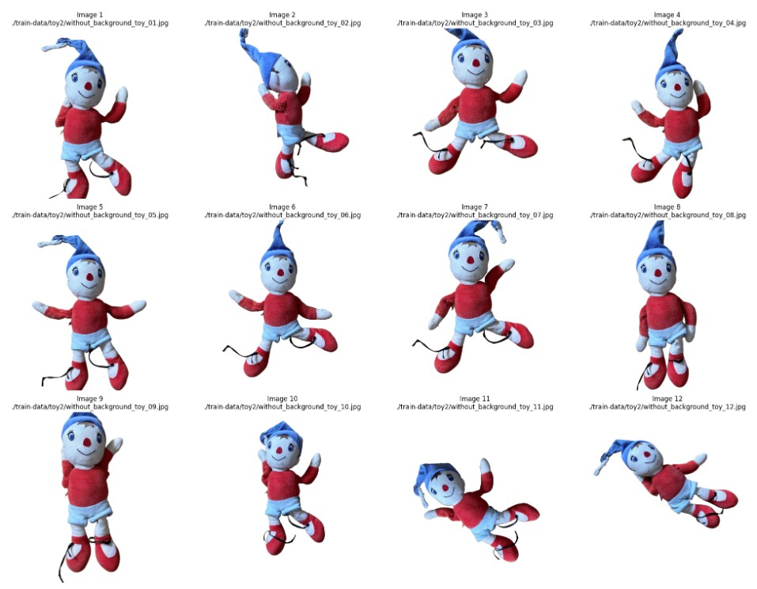
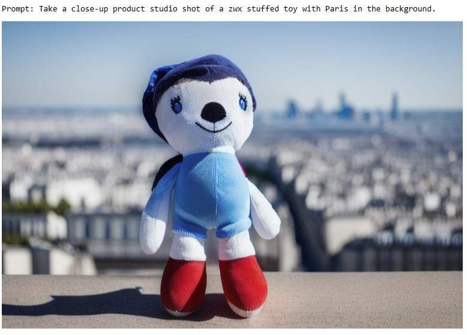
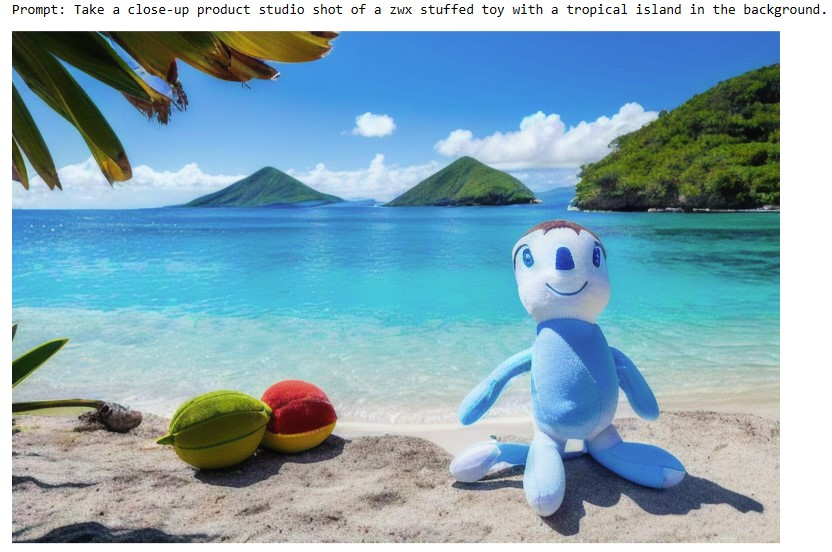
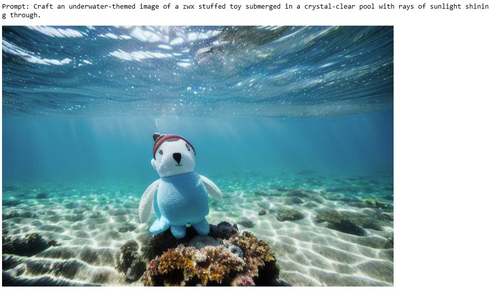
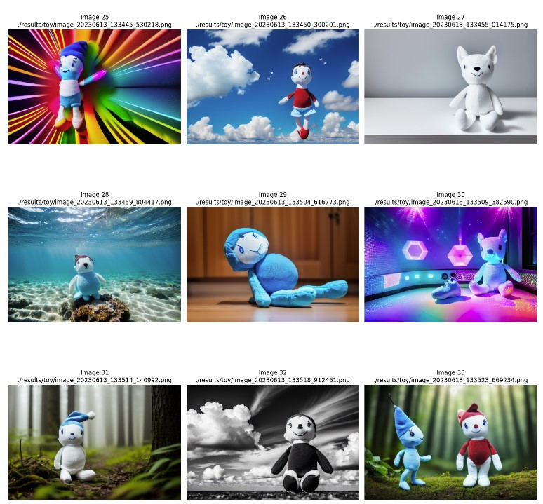

# Finetuning dreambooth with Azure ML

## Add your own Objects and Styles to Image Generation Models.
This solution enables you to inject any object into an existing image generation model like Stable Diffusion using a few example images.
It can also be used for teaching artistic styles (e.g., company branding photography).

**Azure Machine Learning facilitates advanced Generative AI** use cases with its robust resources and efficient experiment management capabilities.

**Powerful GPU clusters** enable multiple resource-intensive fine-tuning runs concurrently. Azure ML provides a framework to manage all associated artifacts, including image datasets, environments, and the resulting models, in a systematic and repeatable manner. The platform's experiment management feature allows maintaining control over numerous training runs, while effectively tracking hyperparameters and results

This notebook provides a practical framework for fine-tuning existing image generation models, such as Stable Diffusion, using DreamBooth and Azure Machine Learning.
**The primary goal is to enable the model to generate images of specific subjects or concepts, based on a set of sample images. This process can be used to insert a specific object into entirely new contexts or scenes.**

**Potential business applications facilitated by this framework include content creation, product visualization, advertising and marketing, as well as education and training.** The fine-tuning operation will be executed using Azure Machine Learning, leveraging its scalability for training on powerful GPU compute resources and its capabilities for managing and tracking experiments and image datasets.

In this solution framework, you will:

- Connect to your Azure Machine Learning Workspace and establish the required resources.
- Provide training images of the specific subject to be incorporated into the image generation model.
- We will remove the background of the images using Azure Computer Vision 4
- Configure and initiate the fine-tuning training job.
- Review the experiment results and retrieve key artifacts, including model checkpoints.
- Generate new images of your chosen subject in diverse scenes.

## Notebook
<a href="Finetuning dreambooth with Azure ML.ipynb"> Python notebook </a>

## Some training images

## Processed training images (with background removal)

## Some artificial images generated

Created: 13-June-2023
Serge Retkowsky | serge.retkowsky@microsoft.com | https://www.linkedin.com/in/serger/
